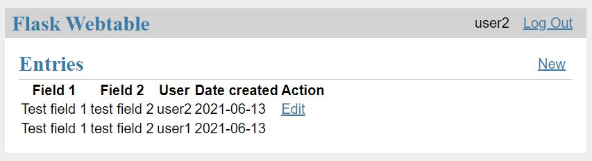

# flask-webtable
A very simple variant of the [Flask tutorial](https://flask.palletsprojects.com/en/2.0.x/tutorial/index.html) to show and edit a single table.

This is mainly for my own reference.

Known limitations:
- CSS not properly refactored
- not installable as a package
- no tests

## Screenshot



## How to run

Windows CMD

```
cd flask-webtable
(first time: py -3 -m venv venv)
venv\Scripts\activate
(first time: pip install Flask)
set FLASK_APP=flaskwebtable
set FLASK_ENV=development
(first time: flask init-db)
flask run
```
